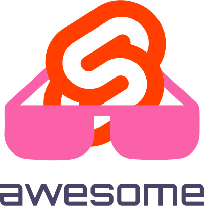

   
  
   
   

## Awesome Svelte 

> ⚡ A curated list of awesome Svelte resources

## Table Of Contents

-   [Resources](#resources)
    -   [Official Resources](#official-resources)
    -   [Community](#community)
    -   [Conferences](#conferences)
    -   [Podcasts](#podcasts)
    -   [Youtube Channels](#youtube-channels)
    -   [Tutorials](#tutorials)
    -   [Scaffold](#scaffold)
        -   [Client](#client)
        -   [Universal](#universal)
-   [Integrations](#integrations)
    -   [Preprocessing](#preprocessing)
-   [Components & Libraries](#components--libraries)
    -   [UI Libraries](#ui-libraries)
    -   [UI Components](#ui-components)
        -   [Table](#table)
        -   [Notification](#notification)
        -   [Icons](#icons)
        -   [Calendar](#calendar)
        -   [Maps](#maps)
        -   [Form](#form)
            -   [Checkbox](#checkbox)
    -   [Frameworks](#frameworks)
        -   [Server Side Rendering](#server-side-rendering)
        -   [Static Site Generation](#static-site-generation)
        -   [Mobile](#mobile)
-   [Dev Tools](#dev-tools)
    -   [Lint](#lint)
    -   [Docs](#docs)
    -   [Test](#test)
    -   [Editors](#editors)
        -   [Visual Studio Code](#visual-studio-code)
        -   [Atom](#atom)
        -   [Sublime Text](#sublime-text)
        -   [Vim](#vim)
        -   [JetBrains](#jetbrains)

## Resources

### Official Resources

-   [Official Guide](https://svelte.dev/tutorial)
-   [API Reference](https://svelte.dev/docs)
-   [GitHub Repo](https://github.com/sveltejs/svelte)
-   [Changelog](https://github.com/sveltejs/svelte/blob/master/CHANGELOG.md)

### Community

-   [Twitter](https://twitter.com/sveltejs)
-   [Discord](https://svelte.dev/chat)

### Conferences

-   [Svelte Summit](https://sveltesummit.com/)

### Podcasts

-   [Svelte Radio](https://www.svelteradio.com/)

### Youtube Channels

-   [Svelte Society](https://www.youtube.com/channel/UCZSr5B0l07JXK2FIeWA0-jw)

### Tutorials

-   [Getting Started with Svelte 3](https://www.digitalocean.com/community/tutorials/getting-started-with-svelte-3) – DigitalOcean
-   [Building My First Svelte App](https://scotch.io/tutorials/building-my-first-svelte-app-thoughts-and-impressions) – Scotch.io
-   [An Introduction to Actions](https://svelte.school/tutorials/introduction-to-actions) – Svelte School

### Scaffold

_Templates / boilerplate / seed / starter kits / stack ensemble / Yeoman generator_

#### Client

_Render Svelte application in the browser only_

-   [sveltejs/template](https://github.com/sveltejs/template) – Template for building basic applications with Svelte with rollup
-   [component-template](https://github.com/sveltejs/component-template) – A base for building shareable Svelte components
-   [svelte-component-template](https://github.com/YogliB/svelte-component-template) – A base for building shareable Svelte 3 components
-   [svelte-pwa-template](https://github.com/tretapey/svelte-pwa) – A starter template for PWAs based in the official Template
-   [svelte-redux-toolkit](https://github.com/Ghosts/svelte-redux-toolkit) – A starter template integrating Redux-Toolkit with Svelte.
-   [svelte-ts-eslint-tailwind](https://github.com/toerndev/svelte-ts-eslint-tailwind) – Starter template and tutorial for adding ESLint, Jest and Tailwind CSS to the official TypeScript template.
-   [svelte-ts-eslint-tailwind](https://github.com/toerndev/svelte-ts-eslint-tailwind) – Svelte TypeScript Rollup ESLint Jest Tailwind CSS
-   [svelte-ts-eslint-prettier-template](https://github.com/NicoCevallos/svelte-template) – Starter template with TS activated, and ESLint and Prettier working together.

#### Universal

_Sapper and SSR_

-   [sapper-template#rollup](https://github.com/sveltejs/sapper-template/tree/rollup) – The default Sapper template, available for Rollup.
-   [sapper-template#webpack](https://github.com/sveltejs/sapper-template/tree/webpack) – The default Sapper template, available for Webpack.
-   [sapper-firebase-typescript-graphql-tailwindcss-actions-template](https://github.com/babichjacob/sapper-firebase-typescript-graphql-tailwindcss-actions-template) – Template that includes Sapper, Firebase functions and hosting, TypeScript and TypeGraphQL, Tailwind CSS, ESLint, and automatic building and deployment with GitHub Actions.
-   [sapper-mdsvex-template](https://github.com/pngwn/sapper-mdsvex-template) – The default Sapper template with mdsvex.
-   [sapper-mdsvex-template-webpack](https://github.com/sveltejs/sapper-template/tree/webpack) – The default Sapper template with mdsvex for webpack.
-   [sapper-postcss-template](https://github.com/babichjacob/sapper-postcss-template) – Template that includes Sapper and PostCSS preprocessing with Tailwind CSS.
-   [sapper-tailwindcss-template](https://github.com/sarioglu/sapper-tailwindcss-template) – The default Sapper template with Tailwind CSS.
-   [sapper-template-firebase](https://github.com/nhristov/sapper-template-firebase) – Starter Rollup template for Sapper apps with Firebase functions, PostCSS, PurgeCSS, CSSNano, Tailwind CSS, and svelte-preprocess.
-   [sapper-typescript-graphql-template](https://github.com/babichjacob/sapper-typescript-graphql-template) – Template that includes Sapper, TypeScript preprocessing, and a GraphQL server through TypeGraphQL.
-   [SENT-template](https://github.com/Zimtir/SENT-template) – SENT (Sapper Express Node Template) and other tools.

## Integrations

### Preprocessing

-   [svelte-preprocess](https://github.com/sveltejs/svelte-preprocess) – A ✨ magical ✨ Svelte preprocessor with sensible defaults and support for: PostCSS, SCSS, Less, Stylus, Coffeescript, TypeScript, Pug and much more.
-   [MDSveX](https://github.com/pngwn/MDsveX) – A markdown preprocessor for Svelte.
-   [svelte-preprocess-markdown](https://github.com/AlexxNB/svelte-preprocess-markdown) – Write Svelte components in markdown syntax
-   [svelte-preprocess-less](https://github.com/ls-age/svelte-preprocess-less) – Svelte preprocessor for less.
-   [modular-css](https://github.com/tivac/modular-css/tree/main/packages/svelte) – Svelte preprocessor support for modular-css.
-   [svelte-preprocess-postcss](https://github.com/TehShrike/svelte-preprocess-postcss) – Use PostCSS to preprocess your styles in Svelte components
-   [svelte-preprocess-sass](https://github.com/ls-age/svelte-preprocess-sass) – Svelte preprocessor for sass

## Components & Libraries

### UI Libraries

-   [Svelte Materialify](https://github.com/TheComputerM/svelte-materialify) – A Material UI Design Component library for Svelte heavily inspired by vuetify.
-   [Sveltestrap](https://github.com/bestguy/sveltestrap) – Bootstrap 4 components for Svelte
-   [Smelte](https://github.com/matyunya/smelte) – UI framework with material components built with Svelte and Tailwind CSS
-   [Svelte Material UI](https://github.com/hperrin/svelte-material-ui) – Svelte Material UI Components

### UI Components

#### Table

_Tables / data grids_

-   [svelte-table](https://github.com/dasDaniel/svelte-table) – A svelte-3 table implementation that allows sorting and filtering
-   [svelte-generic-crud-table](https://github.com/ivosdc/svelte-generic-crud-table) – Agnostic web-component for object-arrays with CRUD functionality.

#### Notification

_Toaster / snackbar — Notify the user with a modeless temporary little popup_

-   [svelte-notifications](https://github.com/beyonk-adventures/svelte-notifications) – Svelte toast notifications component that can be used in any JS application
-   [svelte-favicon-badge](https://github.com/kevmodrome/svelte-favicon-badge) – A custom component that adds a favicon and a badge that you can use to show for example number of unread messages, etc.

#### Icons

-   [svelte-fa](https://github.com/Cweili/svelte-fa) – Tiny FontAwesome 5 component for Svelte
-   [svelte-simple-icons](https://github.com/beyonk-adventures/svelte-simple-icons) – Simple Brand Icons for Svelte
-   [svelte-awesome](https://github.com/RobBrazier/svelte-awesome) – Awesome SVG icon component for Svelte JS, built with Font Awesome icons.
-   [svelte-icons](https://github.com/AnxiousDarkly/svelte-icons) – Icon components for svelte

#### Calendar

_Display non-editable events in a Calendar_

-   [svelte-fullcalendar](https://github.com/YogliB/svelte-fullcalendar) – A Svelte component wrapper around FullCalendar
-   [svelte-calendar](https://github.com/6eDesign/svelte-calendar) – A lightweight datepicker with neat animations and a unique UX.

#### Maps

-   [svelte-googlemaps](https://github.com/beyonk-adventures/svelte-googlemaps) – Svelte Google Maps Components
-   [svelte-mapbox](https://github.com/beyonk-adventures/svelte-mapbox) – MapBox Map and Autocomplete components for Svelte (or Vanilla JS)
-   [leaflet-svelte](https://github.com/anoram/leaflet-svelte) – Svelte wrapper for leaflet.

#### Form

_Let the user create & edit data_

##### Checkbox

_Switch / on/off toggle / checkbox_

-   [svelte-checkbox](https://github.com/HosseinShabani/svelte-checkbox) – A checkbox component for Svelte (Cool animation, Customizable).
-   [svelte-toggle](https://github.com/beyonk-adventures/svelte-toggle) – Toggle component for Svelte

### Frameworks

#### Server Side Rendering

-   [Sapper](https://sapper.svelte.dev/) – The next small thing in web development, powered by Svelte

#### Static Site Generation

-   [Sapper](https://sapper.svelte.dev/) – The next small thing in web development, powered by Svelte
-   [Elder.js](https://elderguide.com/tech/elderjs/) – Opinionated static site generator and web framework for Svelte built with SEO in mind.

#### Mobile

_UI frameworks for mobile_

-   [Svelte Native](https://svelte-native.technology/) – Svelte controlling native components via Nativescript
-   [Framework7](https://framework7.io/svelte/) – Full featured HTML framework for building iOS & Android apps

## Dev Tools

### Lint

_Lint and format your code_

-   [eslint-plugin-svelte3](https://github.com/sveltejs/eslint-plugin-svelte3) – An ESLint plugin for Svelte v3 components.
-   [prettier-plugin-svelte](https://github.com/sveltejs/prettier-plugin-svelte) – Format your svelte components using prettier.
-   [svelte-check](https://www.npmjs.com/package/svelte-check) – Check your code with svelte-check.

### Docs

_Create documentation_

-   [svelte-docs](https://github.com/AlexxNB/svelte-docs) – A rapid way to write documentation for your Svelte components
-   [sveltedoc-parser](https://github.com/alexprey/sveltedoc-parser) – Generate a JSON documentation for a Svelte component

### Test

-   [svelte-jester](https://github.com/mihar-22/svelte-jester) – A Jest transformer for Svelte - compile your components before importing them into tests.
-   [@testing-library/svelte](https://github.com/testing-library/svelte-testing-library) – 🐿️ Simple and complete Svelte DOM testing utilities that encourage good testing practices
-   [jest-transform-svelte](https://github.com/rspieker/jest-transform-svelte) – Jest Transformer for Svelte components

### Editors

_Text editor plugins_

#### Visual Studio Code

-   [Svelte for VS Code](https://marketplace.visualstudio.com/items?itemName=svelte.svelte-vscode) – Provides syntax highlighting and rich intellisense for Svelte components
-   [Svelte 3 Snippets](https://marketplace.visualstudio.com/items?itemName=fivethree.vscode-svelte-snippets) – Svelte 3 Snippets for VS Code

#### Atom

-   [ide-svelte](https://atom.io/packages/ide-svelte) – Provides syntax highlighting and rich intellisense for Svelte components
-   [language-svelte](https://atom.io/packages/language-svelte) – Provides syntax highlighting for Svelte Components, directives and other Svelte specific syntax in Atom.

#### Sublime Text

-   [Svelte](https://packagecontrol.io/packages/Svelte) – Sublime Text syntax highlighting for Svelte 3 components

#### Vim

-   [vim-svelte](https://github.com/evanleck/vim-svelte) – Vim syntax highlighting and indentation for Svelte 3 components.
-   [vim-svelte-plugin](https://github.com/leafOfTree/vim-svelte-plugin) – Vim syntax and indent plugin for .svelte files
-   [coc-svelte](https://github.com/coc-extensions/coc-svelte) – svelte support for (Neo)Vim

#### JetBrains

-   [Svelte](https://plugins.jetbrains.com/plugin/12375-svelte)

* * *

